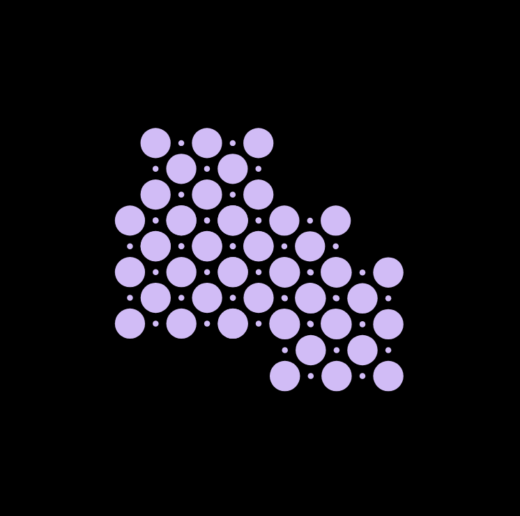
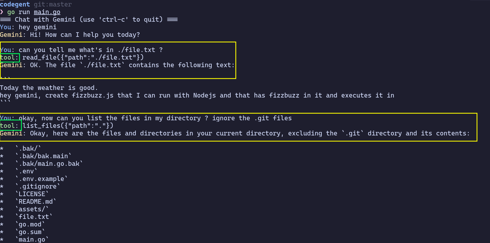

# Codegent

<div align="center">
  
  
  ***A dead simple AI coding agent powered by Gemini & "for & while loops"***
  
  [](https://go.dev/)
  [](LICENSE)
</div>

`Codegent` is a command-line AI agent which uses the most battle-tested, time-tested coding technique: "For & while Loops".
Inspired by the blog post by Thorsten Ball.
- Twitter: [@thorstenball](https://x.com/thorstenball)
- [Blog post](https://ampcode.com/how-to-build-an-agent)

<div align="center">
  <video width="640" height="360" controls>
    <source src="assets/tools-demo.mp4" type="video/mp4">
    Your browser does not support the video tag.
  </video>
</div>
## Features

- **Interactive Chat**: Engage in natural language conversation with the Gemini AI model
- **Tool-based Architecture**: Powerful execution of file operations through a simple agent loop

### Tools Available:

| Tool | Name | Description |
|------|------|-------------|
| 📖 | `read_file` | Retrieve the contents of a specified file |
| 📋 | `list_files` | List files and directories in a given path (defaults to current directory) |
| ✏️ | `edit_file` (still improving this,has bugs) | Replace text in existing files or create new files with specified content |


## Prerequisites

Before you can build and run `Codegent`, ensure you have the following installed:

- **Go**: Version 1.22+ [Download and install Go](https://go.dev/doc/install)
- **Gemini API Key**: Obtain an API key from Google for the Gemini AI service. [Get your API key](https://ai.google.dev/)

## Installation

1. **Clone the Repository** (or download the source code):
   ```bash
   git clone https://github.com/anubhavgh023/codegent.git
   cd codegent
   ```

2. **Install Dependencies**:
   ```bash
   go mod tidy
   ```

3. **Configure Environment Variables**:
   Create a `.env` file in the project root with your Gemini API key:
   ```
   GEMINI_API_KEY=your_api_key_here
   ```

## Usage

1. **Build the Project**:
   ```bash
   go build -o codegent
   ```

2. **Run Codegent**:
   ```bash
   ./codegent
   ```

3. **Interact** with the AI agent:
   - Chat naturally about programming tasks
   - Ask it to create, read, list, or modify files

<div align="center">
  
</div>

## How It Works
Codegent uses a simple but effective architecture:

1. Initializes a connection to the Gemini API
2. Creates an agent with access to file operation tools
3. Enters a loop where it:
   - Takes user input
   - Sends it to the Gemini model
   - Processes the response
   - Executes any tool calls
   - Returns results to the model
---

<div align="center">
  <p>Built by <a href="https://github.com/anubhavgh023">Anubhav</a></p>
  <p>Star ⭐ this repository if you find it useful !</p>
</div>